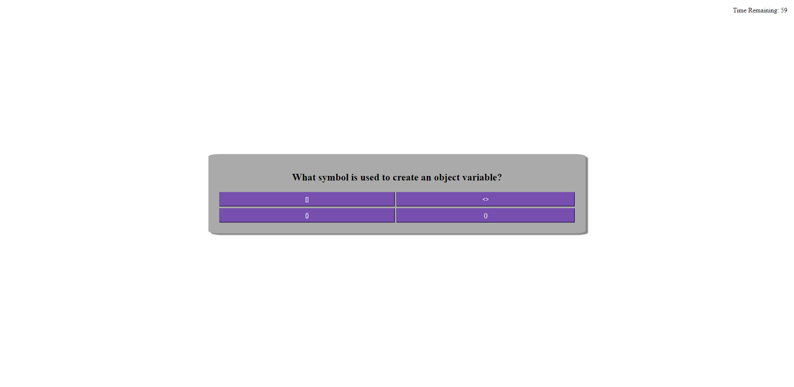

# 04 Web APIs : Code Quiz

## Instructions

Upon hitting the start button, the quiz will begin. The user should try to answer as many questions as possible until they either answer all 25 questions or the timer ends.

When the quiz is over, the user will be prompted to enter their name, which will accompany their score on the highscore board. 

## Appearance

The website has a section element in the center of the screen which contains the majority of the content for the application. This includes the starting button, the quiz content, the score recording screen and the highscore screen. When the start button is pressed, a timer appears in the top right of the screen. There is also a View Highscores which will take you to the highscore screen when clicked.

